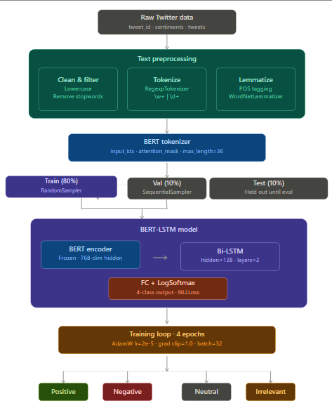
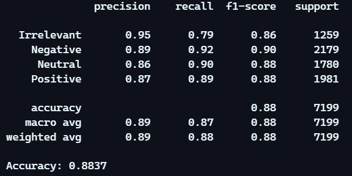
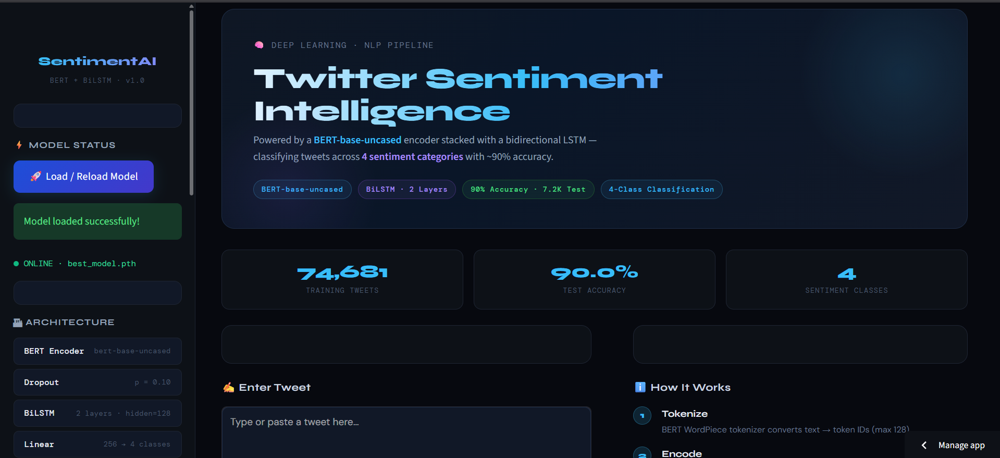
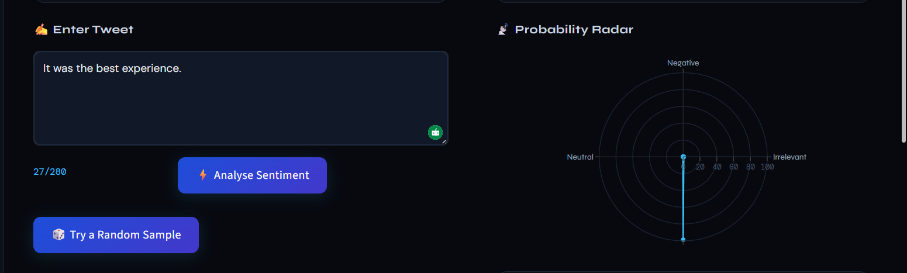
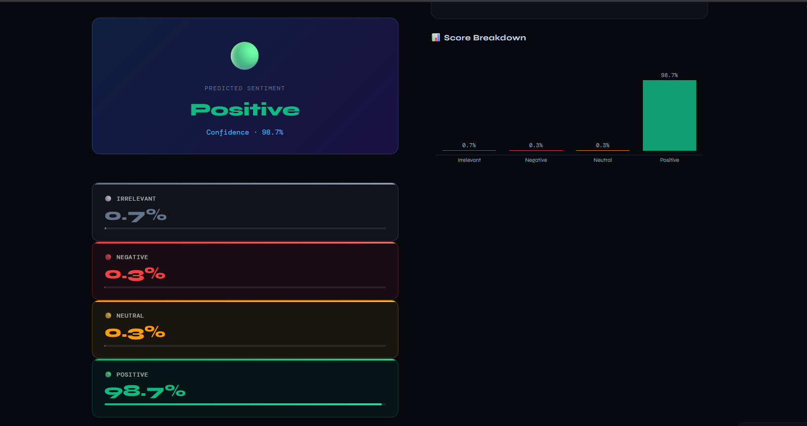

<h1 align="center">🧠 SentimentAI · Twitter Sentiment Analysis</h1>

<p align="center">
  
</p>

---

## 🚀 Overview

**SentimentAI** is a deep learning-based web application that classifies tweets into **four sentiment categories** using a hybrid **BERT + BiLSTM architecture**.

The system leverages **transformer-based contextual embeddings** along with sequential learning to achieve high accuracy and robust sentiment understanding.

👉 Designed for real-world NLP applications like:
- Social media monitoring  
- Brand sentiment analysis  
- Opinion mining  

---

## 🎥 Live Demo

<p align="center">
  <a href="https://twitter-sentiment-analysis-vvwqu3ohssprazxy7nf7q6.streamlit.app/">
    
  </a>
</p>

---

## 🧠 Model Architecture

<p align="center">
  
</p>

| Layer | Details |
|------|--------|
| BERT Encoder | bert-base-uncased |
| Dropout | p = 0.10 |
| BiLSTM | 2 layers · hidden size = 128 |
| Linear | 256 → 4 classes |
| Log-Softmax | Output activation |

---

## 🏷️ Sentiment Classes

| Class | Description |
|------|------------|
| 🟢 Positive | Happiness, excitement, praise |
| 🔴 Negative | Anger, sadness, criticism |
| 🟡 Neutral | Informational, no emotion |
| ⚪ Irrelevant | Spam or unrelated content |

---

## 📊 Performance

<p align="center">
  
</p>

| Metric | Score |
|------|------|
| Accuracy | 90.0% |
| Precision | 90.0% |
| Recall | 90.0% |
| F1 Score | 90.0% |

---

## 📁 Dataset

- 📊 74,681 tweets  
- 🏷️ 4 sentiment classes  
- 📌 Real-world Twitter dataset  

---

## ⚙️ Tech Stack

| Layer | Technology |
|------|-----------|
| Frontend | Streamlit |
| Model | PyTorch + HuggingFace |
| NLP | Transformers (BERT) |
| Visualization | Plotly |
| Deployment | Streamlit Cloud |
| Model Hosting | HuggingFace Hub |

---

## 📱 Application Preview

<p align="center">
  
  
  
</p>

---

## 🔄 Working Flow

1. 📝 User inputs tweet text  
2. 🔍 Text is tokenized using BERT tokenizer  
3. 🧠 BERT extracts contextual embeddings  
4. 🔄 BiLSTM processes sequence  
5. 📊 Model predicts sentiment class  
6. 📱 Result displayed in UI  

---

## 🤗 Model Weights

<p align="center">
  <a href="https://huggingface.co/puneethas26/sentiment-bert-bilstm">
    
  </a>
</p>

---

## ⚙️ Run Locally

```bash
git clone https://github.com/puneethas26/sentiment-bert-bilstm.git
cd sentiment-bert-bilstm
pip install -r requirements.txt
streamlit run app.py
